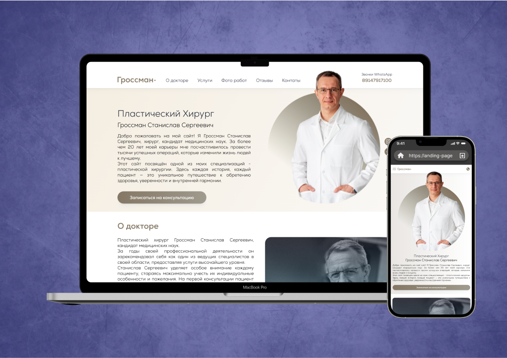

# Plastic Surgeon Dr. Gossman Website & Adaptive Design
Project Overview: The website for Dr. Gossman, a renowned plastic surgeon, offers visitors a sleek, modern, and user-friendly platform to explore a variety of cosmetic procedures. Built with a robust tech stack, the website focuses on delivering an intuitive user experience, providing detailed information on services, patient testimonials, and contact options. It adapts seamlessly across different devices, ensuring users have a smooth experience, whether they are on a desktop, tablet, or mobile.

➼ Technology Stack:
- HTML5 for structure
- CSS3 for styling
- SCSS/Sass for advanced styling and better maintainability
- JavaScript for dynamic functionality
- Gulp for task automation
- Flexbox & Grid for responsive design
- BEM methodology for clean, scalable code

The site showcases an adaptive design, offering a flawless user experience on all screen sizes, while integrating practical and interactive elements like contact forms, before-and-after galleries, and online consultation booking.
